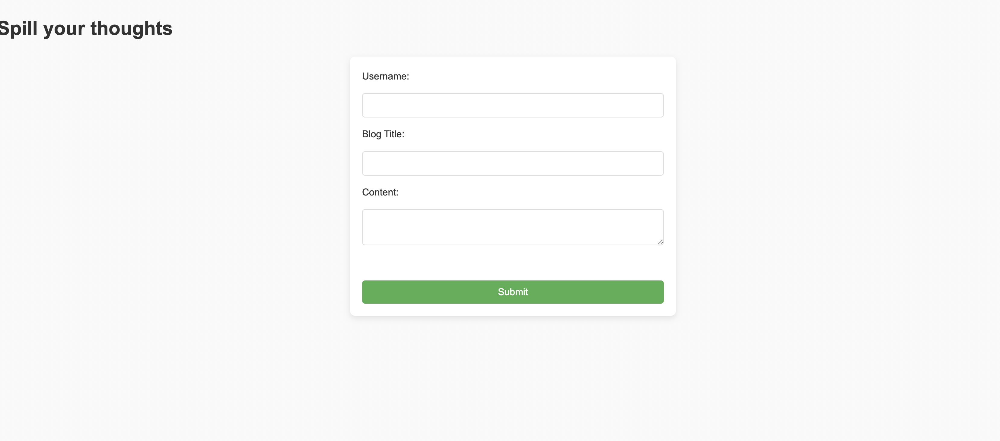
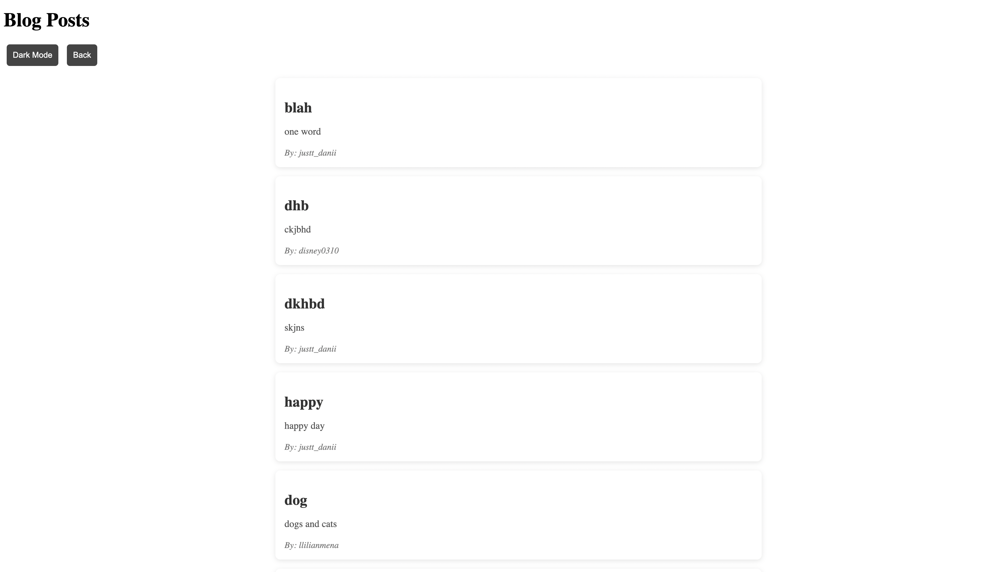
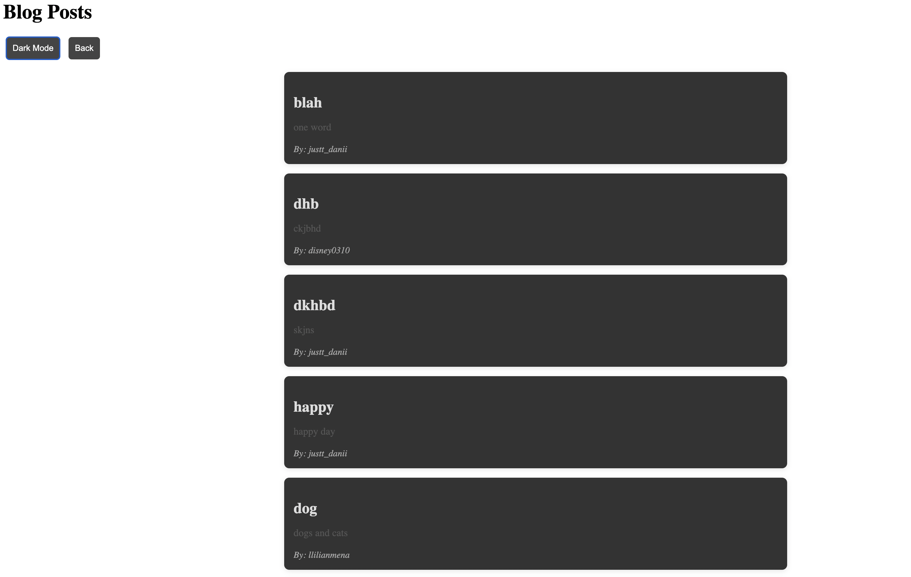

# ✨ **Syntax and Soul** ✨  

Welcome to **Syntax and Soul** — where you become the author of your own digital space! This app lets you share your thoughts, rants, and brilliant ideas effortlessly. Let’s dive into what this blog can do! 🚀  

---
## Link
https://llilianmena.github.io/Syntax-and-Soul-m4/

## 🎯 **Acceptance Criteria**  

### 📌 **GIVEN** a personal blog:  

- **WHEN** I load the app,  
  - **THEN** I am greeted with a landing page featuring a form to input my `username`, `blog title`, and `blog content`.  

- **WHEN** I submit the form,  
  - **THEN** my blog post gets saved to `localStorage` — because even my browser believes in saving my genius thoughts! 💾  

- **WHEN** the form submits,  
  - **THEN** I get redirected to the magical `Posts` page to admire my masterpiece.  

- **WHEN** I try to submit an incomplete form (no username, title, or content),  
  - **THEN** I’m gently reminded to "Hey, fill in all the fields!" ✋  

---

### 🔥 **Posts Page Perks**  

- **WHEN** I land on the `Posts` page,  
  - **THEN** I’m presented with a sleek header, a `Dark Mode` toggle (because night owls need style too 🌙), and a `Back` button to create more content.  

- **WHEN** I click the `Dark Mode` toggle,  
  - **THEN** my page's style transforms between light and dark — talk about mood swings!  

- **WHEN** I hit the `Back` button,  
  - **THEN** I get redirected to the `Landing Page` to create even more legendary content.  

- **WHEN** I browse the content area,  
  - **THEN** I see a glorious list of my blog posts, pulled straight from `localStorage`.  

- **WHEN** I peek into `localStorage` (because curiosity rules),  
  - **THEN** I find a clean `JSON array` filled with blog post objects, each containing the `author's username`, `title`, and `content`.  

- **WHEN** I read a single blog entry,  
  - **THEN** I can see the `title`, `content`, and `author's name` — basically, the VIP details of the post.  
